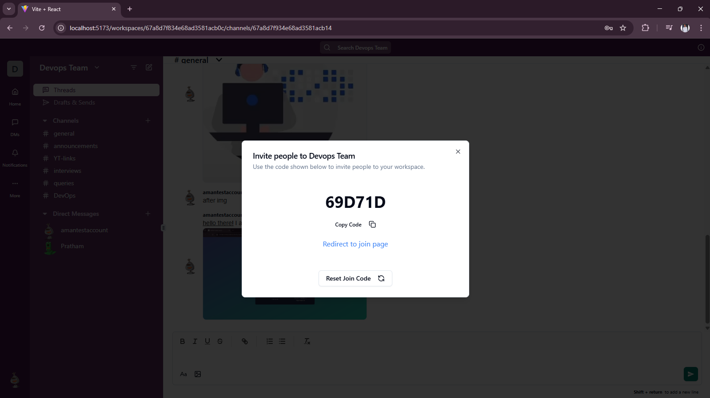
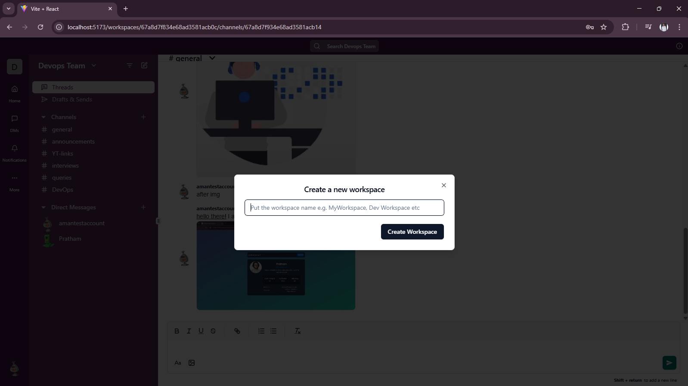
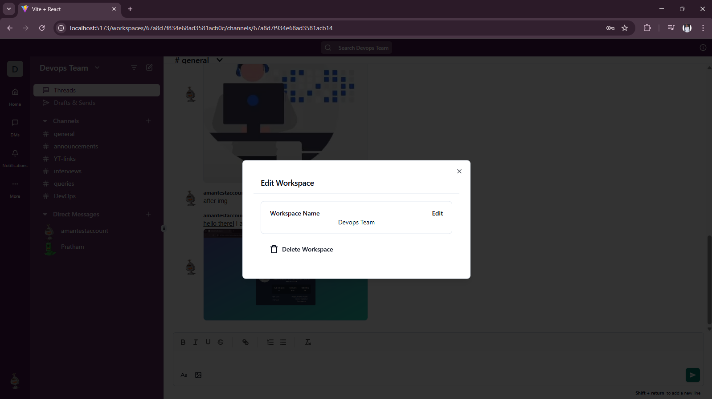
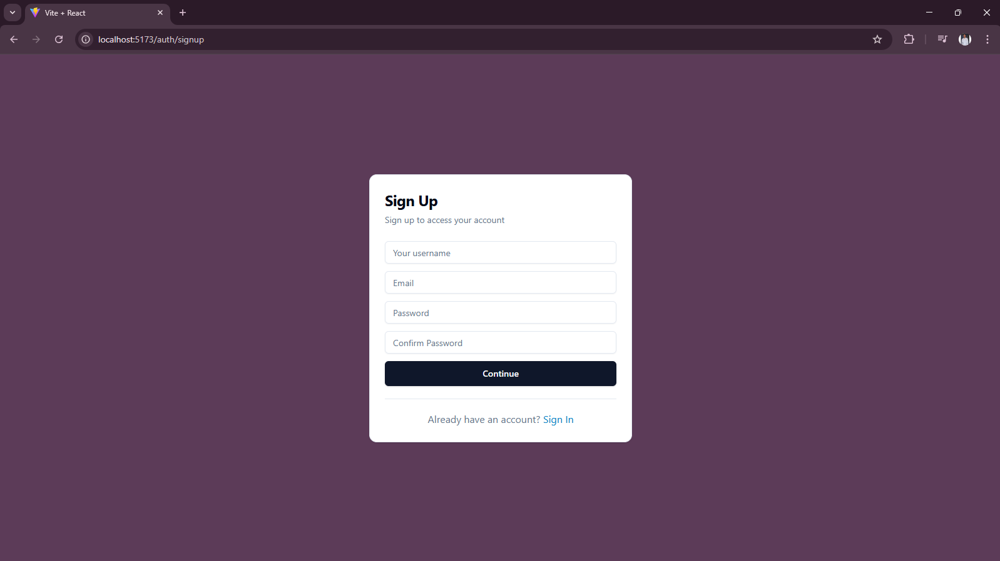
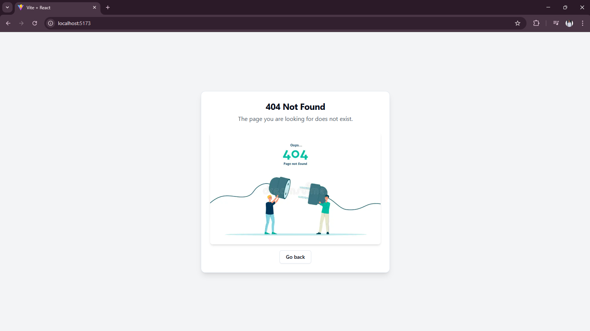

# 💬 Message Slack App – Real-time Team Collaboration Platform

> A modern Slack-inspired application enabling real-time messaging, team management, and productivity tools for seamless collaboration.

---

## 📌 Overview

- 💼 **Message Slack App** is a full-stack team collaboration platform built for modern teams to stay connected and productive.
- 💬 Enables **real-time chat** in public channels and private messages using WebSockets.
- 🔐 Secure user authentication with email verification and role-based access.
- 📩 Email notifications for verification and activity alerts.
- 💳 Payment integration via **Razorpay** for premium workspace plans.
- 📦 Background task handling using **Bull** and **Redis** for queue management.
- 🧱 Built with a scalable modular architecture, easily extensible for future features.

---

## 🚀 Features

### 🛠️ Workspace & User Management

- 🔑 Sign-up/Login with secure **JWT authentication**
- 🧑‍🤝‍🧑 Create and manage multiple **workspaces**
- 👥 Invite team members via email
- ⚙️ Role-based permissions and admin control
  
  
  

### 💬 Real-time Messaging

- 📡 Real-time messaging using **Socket.io**
- 🖊️ Rich text message support using **Quill Editor**
- 📌 Public channels and private DMs
- 🗃️ Resizable UI panels for an intuitive chat layout

### 📨 Email & Notification System

- ✉️ OTP-based email verification
- 🔔 In-app toasts and notifications using **Radix UI**
- 📬 Transactional and activity emails via **Nodemailer**

### 💳 Payment & Subscription

- 💰 Razorpay integration for workspace monetization
- 📄 Invoicing and payment tracking
- 🧾 Tiered plans for extended features

### ⚙️ Queue & Job Management

- ⏳ Background job processing using **Bull**
- 🧃 Queue monitoring with **Bull Board**
- 🧵 Redis for efficient job queueing

---

## 🧱 Tech Stack

### 💻 Frontend

Built using **React 18**, with a responsive, accessible design using **Tailwind CSS** and **Radix UI**.

- `react`, `react-router-dom`, `@tanstack/react-query`
- `tailwindcss`, `tailwindcss-animate`, `clsx`, `class-variance-authority`
- `socket.io-client` – Real-time communication
- `quill` – Rich-text message input
- `react-verification-input` – OTP UI
- `lucide-react`, `react-icons` – Icons
- `@radix-ui/react-*` – UI components (toast, dialog, dropdown, tooltip, etc.)

### 🖥️ Backend

Powered by **Node.js**, **Express**, and **MongoDB**, optimized for real-time, secure, and scalable performance.

- `express`, `mongoose`, `cors`, `dotenv`, `http-status-codes`
- `jsonwebtoken` – JWT authentication
- `bcrypt` – Password encryption
- `nodemailer` – Email service
- `zod` – Schema validation
- `razorpay` – Payment gateway integration
- `uuid` – Unique ID generation
- `bull`, `@bull-board/express` – Background jobs and monitoring
- `ioredis` – Redis client for queue management

---
